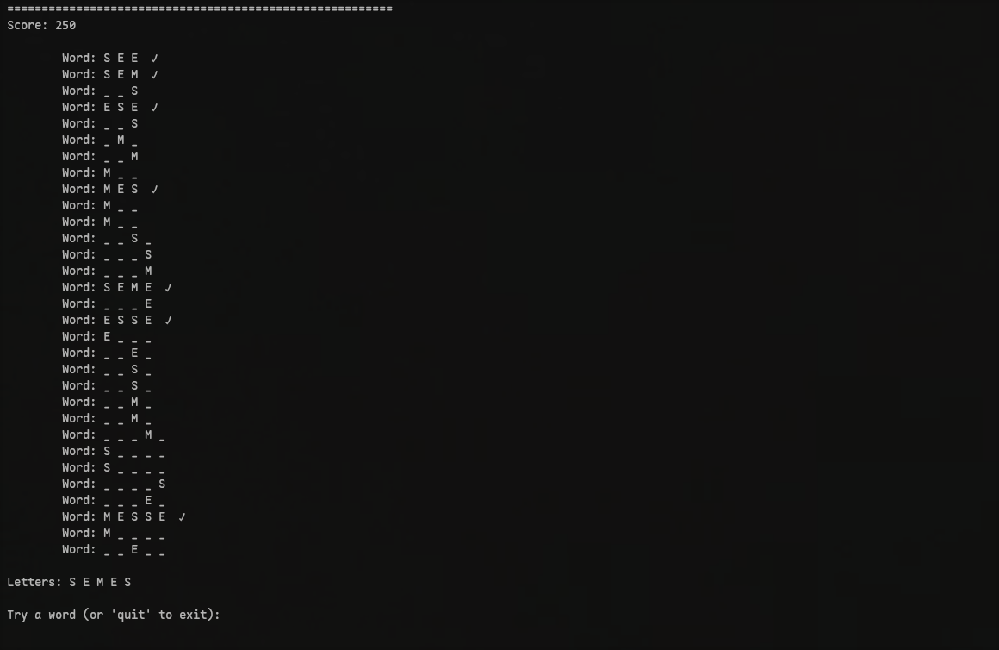

# WALGO



## Installation & Usage

1. > Clone the repo
   > 
   > ```shell
   > git clone https://github.com/UsboKirishima/walgo.git && cd walgo
   > ```

2. > Compile
   > 
   > ```sh
   > make -j4
   > ```

3. > Run 
   > 
   > ```sh
   > ./walgo <it|en>
   > ```
   > 
   > 
